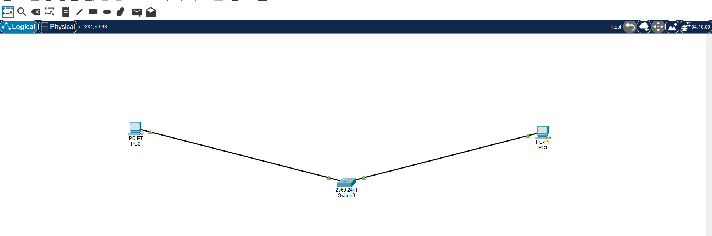
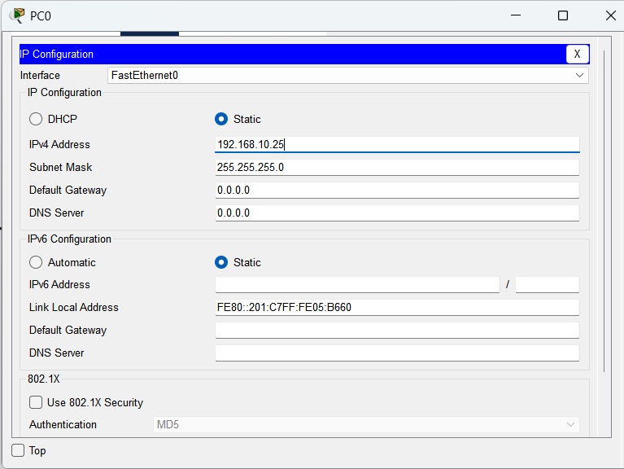
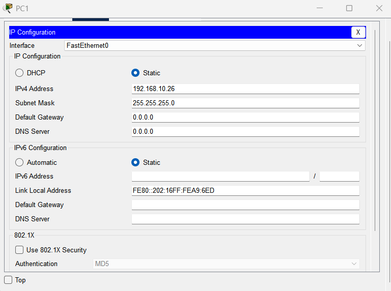

# Ping Troubleshooting in Cisco Packet Tracer

## Aim

To troubleshoot and identify the causes of ping failures in Cisco
Packet Tracer by checking physical connectivity, IP configuration,
subnet mask, ARP and network connectivity.

## Purpose

The purpose of this experiment is to understand how to identify
and fix network connectivity problems using basic troubleshooting
commands and Packet Tracer Simulation Mode.

## Software Used

- Cisco Packet Tracer
- PC Command Prompt

## Network Topology



## IP Address Configuration

### PC0

- IP Address: 192.168.10.25
- Subnet Mask: 255.255.255.0



### PC1

- IP Address: 192.168.10.26
- Subnet Mask: 255.255.255.0



## IP Verification

### PC0

```text
ipconfig /all

PC1
ipconfig /all

Connectivity Testing

The connectivity between PC0 and PC1 was tested using the ping command.

ping 192.168.10.26

ARP Verification

The ARP table was checked using:

arp -a

Simulation Mode

ARP and ICMP packets were observed using Simulation Mode and the
Capture/Forward option.

Troubleshooting Steps
Check the cable connection.
Check the link status.
Verify the IP address.
Verify the subnet mask.
Check the default gateway if a router is used.
Test the local PC using ping 127.0.0.1.
Ping the destination PC.
Check the ARP table using arp -a.
Use Simulation Mode to observe ARP and ICMP packets.
Result

The connectivity between the PCs was successfully verified using
the ping command. The experiment also demonstrated how IP
configuration, ARP, and physical connectivity affect network
communication.
